# Walkthrough for Task 2

Stuck on a step? We've included animations showing the main actions that you
need to take if you get stuck during the
refactoring part of the assignment.

You may notice _slight_ differences in the code depending on how
you resolved the Checkstyle errors initially, but your code should
look very similar.

> For some steps, what you see in the context menus may differ, so
> you may need to look up specific refactorings in IntelliJ if you
> have trouble finding the right option in the menus — there are
> shortcut keys to execute various actions in IntelliJ.

---

# Step 01

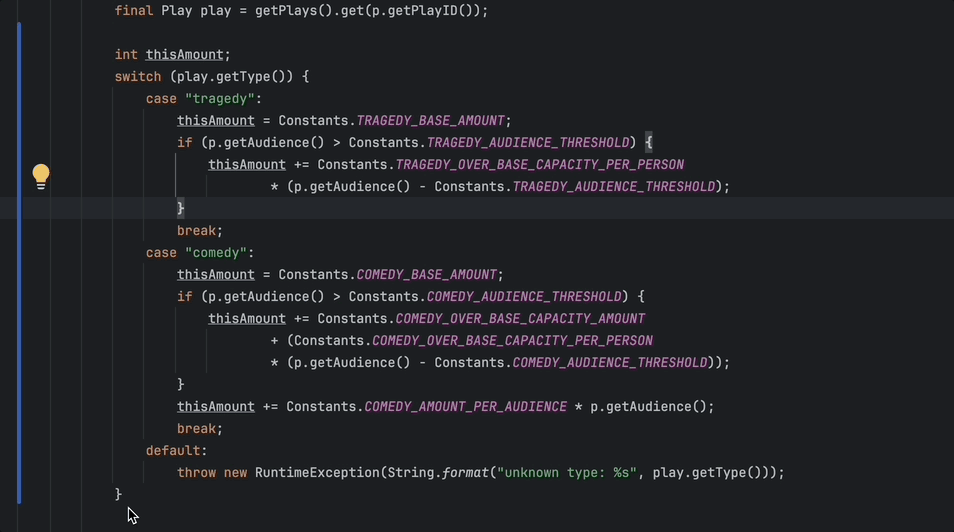

---

# Step 02

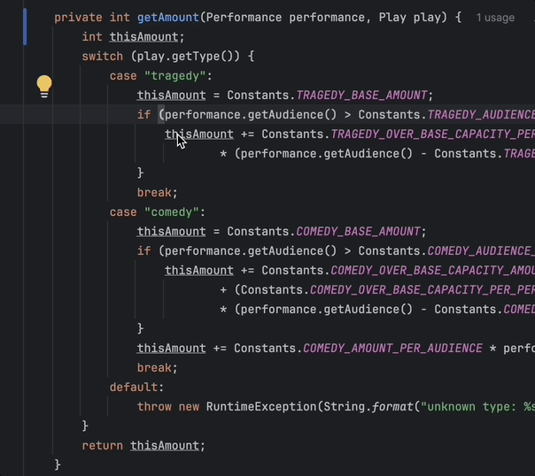

---

# Step 04

## Substep 1

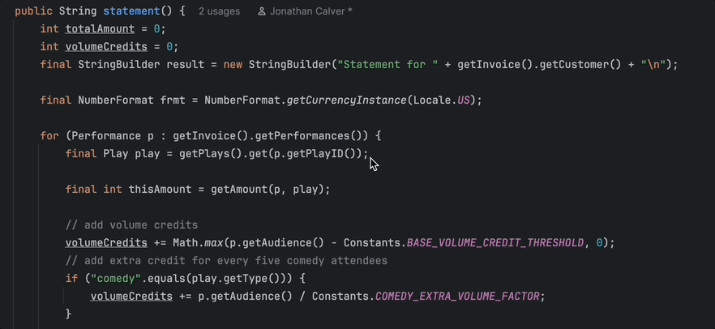

---

## Substep 2

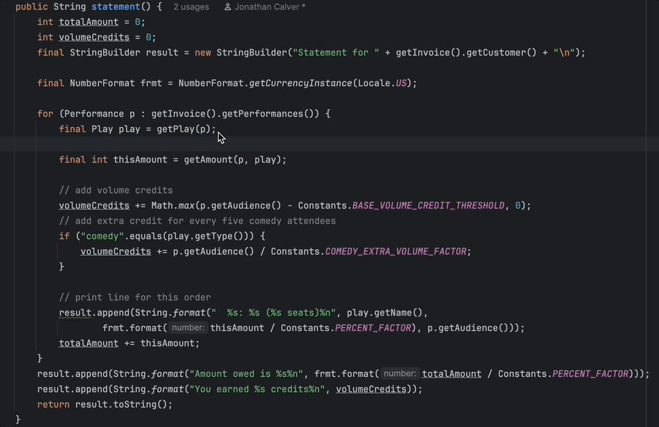

---

## Substep 3a

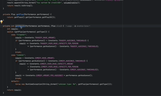

---

## Substep 3b

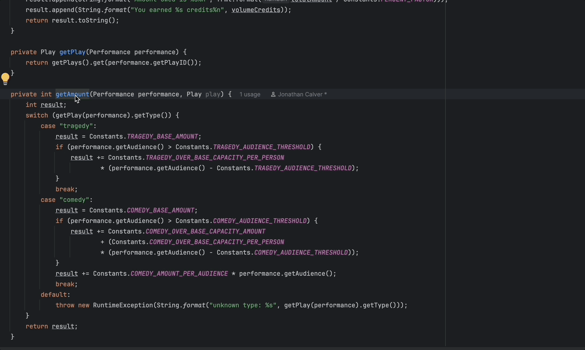

---

# Step 05

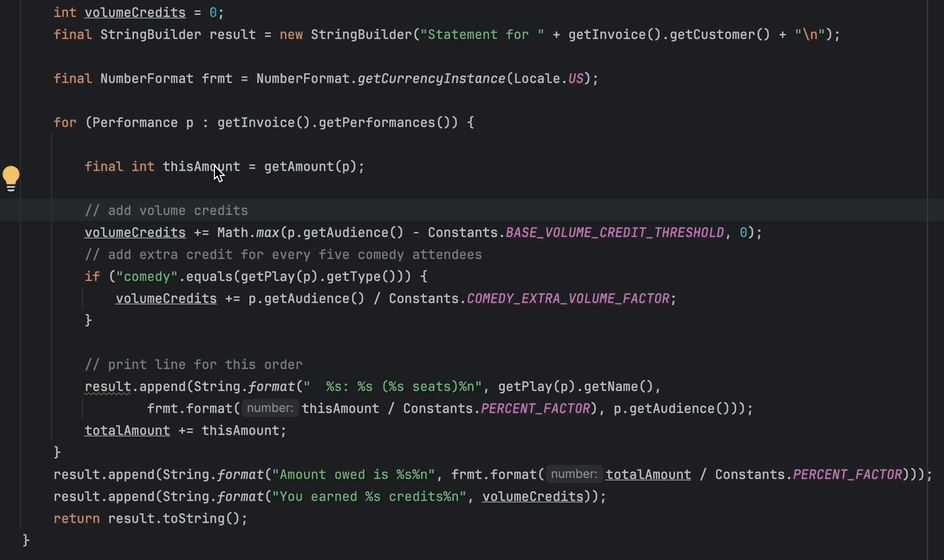

---

# Step 08

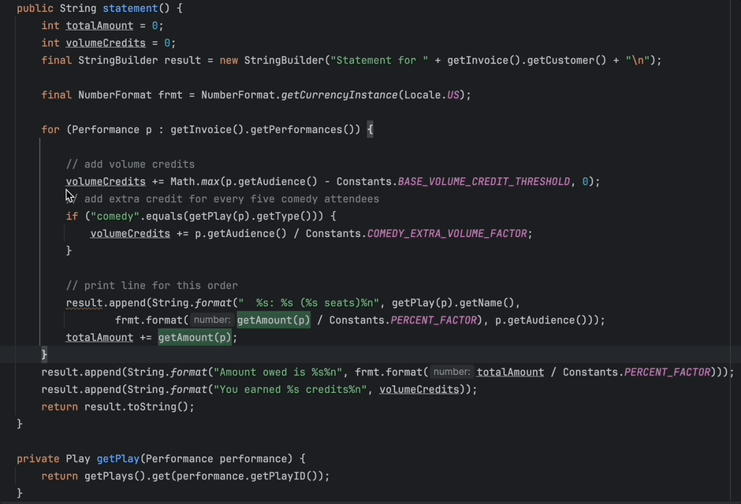

---

# Step 13

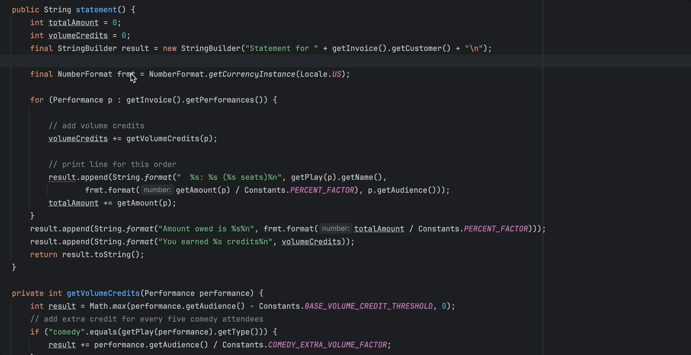

---

# Step 14

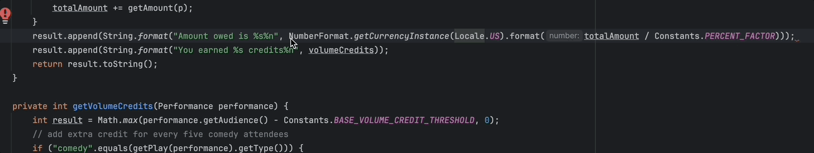

---

# Step 17

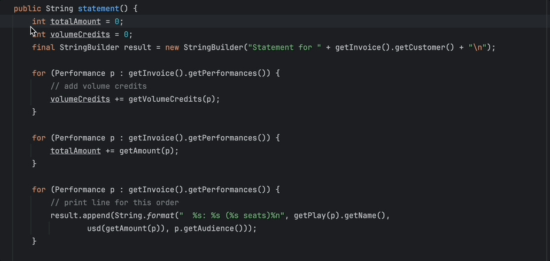

---

# Step 18

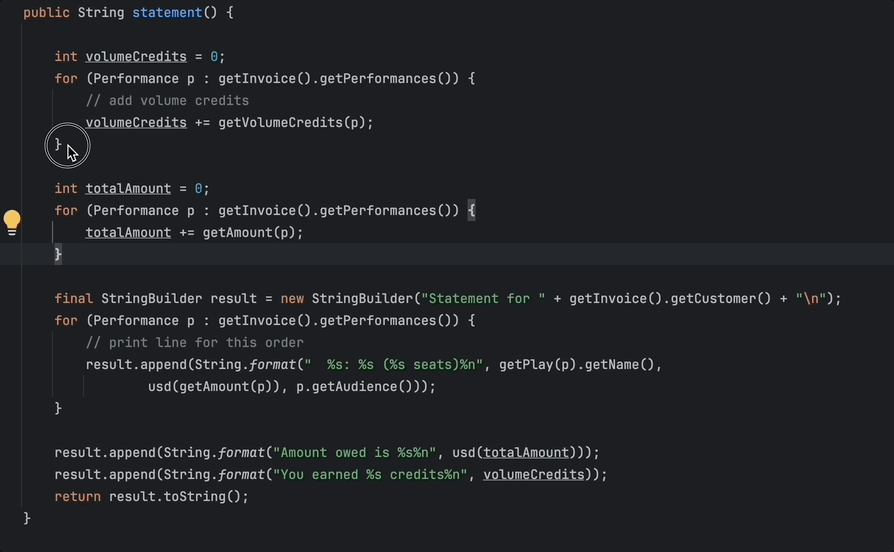

---

# Step 18

---